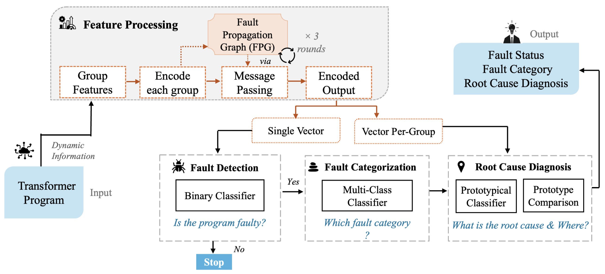
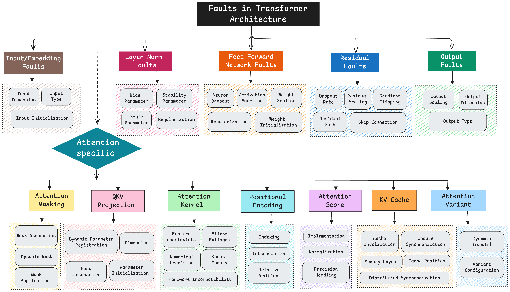
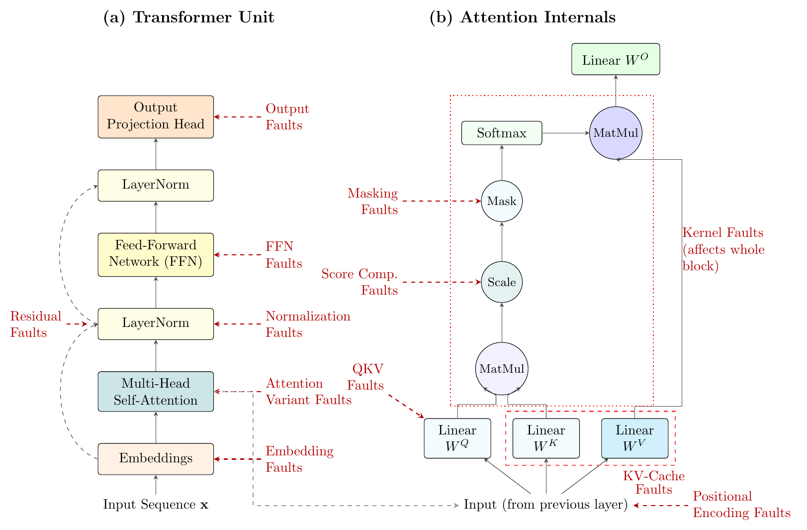
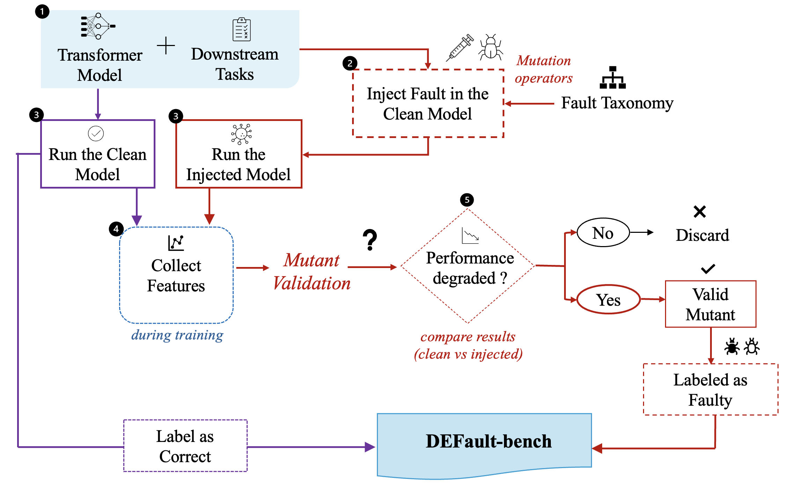
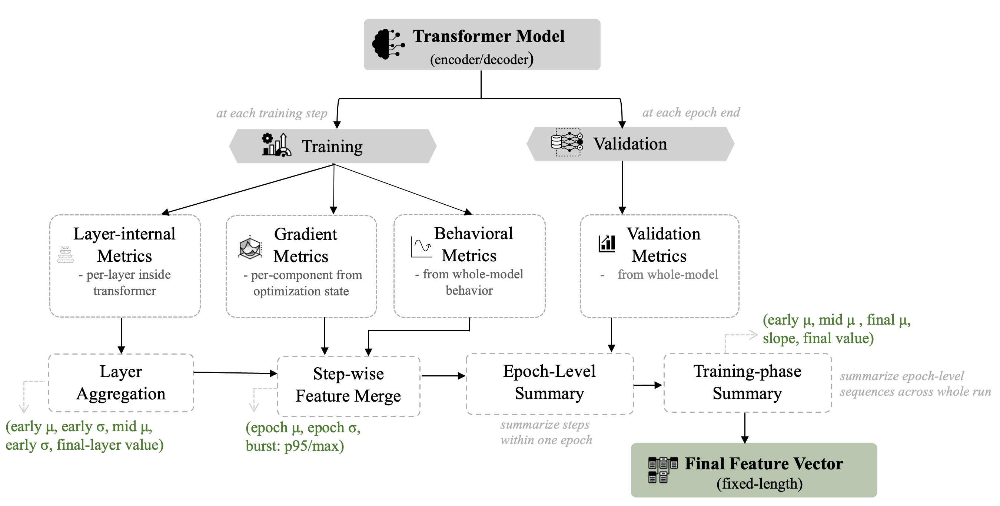
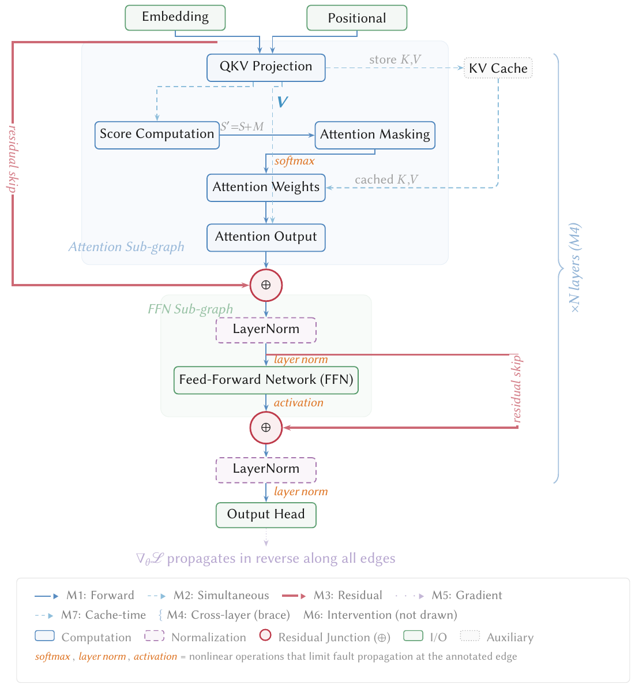
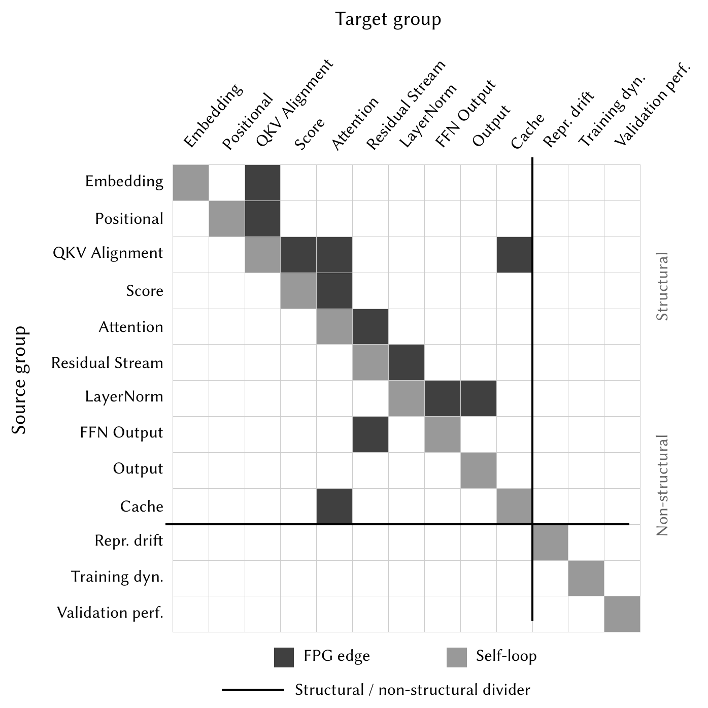
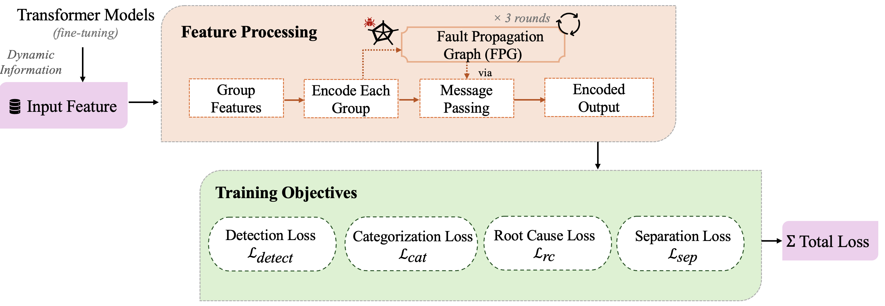

# DEFault++ Architecture

A figure-by-figure walk-through of how DEFault++ works, with pointers to
the code that implements each part. For the user-facing quick start, see
the [project README](../README.md). For the API and CLI reference, see the
[package README](../defaultplusplus/README.md).

## Contents

- [1. The big picture](#1-the-big-picture)
- [2. The fault taxonomy](#2-the-fault-taxonomy)
- [3. Where each fault lives in the block](#3-where-each-fault-lives-in-the-block)
- [4. Building DEFault-bench](#4-building-default-bench)
- [5. Feature construction](#5-feature-construction)
- [6. The Fault Propagation Graph](#6-the-fault-propagation-graph)
- [7. The group-level adjacency matrix](#7-the-group-level-adjacency-matrix)
- [8. Training the diagnostic model](#8-training-the-diagnostic-model)

---

## 1. The big picture

DEFault++ reads runtime information from a transformer fine-tuning run and
produces a three-level diagnosis. The figure shows the whole flow.

The left side takes dynamic information from the transformer program and
turns it into features. Feature processing encodes each feature group with
its own small network, passes messages over the Fault Propagation Graph
for three rounds, and produces both a single pooled vector and a
per-group vector. The right side runs three classifiers in order.

- **Fault detection** is a binary classifier on the pooled vector. A run
  that looks correct stops here.
- **Fault categorization** is a multi-class classifier on the pooled
  vector. It names the responsible transformer subsystem.
- **Root-cause diagnosis** is a prototypical classifier on the per-group
  vector. It names the specific bug pattern and reports which feature
  groups support the call.

Code: the model is `HierarchicalDiagnosisModel` in
[`diagnosis/model.py`](../defaultplusplus/src/defaultplusplus/diagnosis/model.py).
The runtime entry point is `load_pretrained(arch).predict(features)` in
[`diagnosis/predictor.py`](../defaultplusplus/src/defaultplusplus/diagnosis/predictor.py).

---

## 2. The fault taxonomy

DEFault++ targets 12 fault categories and 45 root causes. The tree below
shows every category and the root causes under it.

Five categories are architecture-level and apply to any transformer block:
Input/Embedding, LayerNorm, FFN, Residual, and Output. Seven are
attention-specific: Masking, QKV, Kernel, Positional, Score, KV Cache, and
Variant. KV Cache is decoder-only, so encoders see 11 categories and 40
root causes while decoders see all 12 and 45.

Each root cause is a fault mechanism, and **DEForm** injects it with one or
more mutation operators. The catalog has 52 operators. Some root causes
are covered by more than one operator. The QKV parameter-initialization
root cause, for example, is covered by three operators that zero the Q, K,
and V projections separately.

Code: the operator catalog is
[`deform/operators.py`](../defaultplusplus/src/defaultplusplus/deform/operators.py),
the injector implementations are
[`deform/operator_impls/`](../defaultplusplus/src/defaultplusplus/deform/operator_impls/),
and `root_cause_label_space(arch)` returns the 40/45 label space.

---

## 3. Where each fault lives in the block

The taxonomy maps directly onto the transformer block. The left panel
places the architecture-level categories on the block, and the right panel
expands the attention internals.

Reading the right panel from the bottom up follows the attention
computation. The Q, K, V projections feed a first matrix multiply (QKV
faults), then scaling (Score faults), then masking (Masking faults), then
softmax and the second matrix multiply with V, then the output projection.
Kernel faults sit beside the whole attention block because they change how
the kernel runs rather than any single tensor. KV-Cache and Positional
faults attach at the projection inputs.

This placement is why component-level features matter. A masking fault and
a QKV fault can leave the same end-task metric yet produce different
attention-level and projection-level patterns.

---

## 4. Building DEFault-bench

DEFault-bench is the labeled dataset the model trains and is evaluated on.
The workflow injects a fault, runs paired clean and faulty fine-tuning,
and keeps only faults that provably changed behavior.

Step by step.

1. Start from a clean transformer and a downstream task.
2. Inject one fault from the taxonomy with a DEForm operator.
3. Train the clean model and the injected model under five matched seeds.
4. Collect component-level features during training.
5. Run mutant validation. A one-sided sign-flip permutation test over the
   five seed-paired deltas decides whether the injected fault changed task
   performance at the chosen significance level.
6. A fault that passes is a valid mutant, labeled faulty. A fault that
   does not pass is discarded so its label stays reliable.

Clean, label-preserving variants form the correct class, which makes the
two classes symmetric by construction.

Code: the kill test is `is_killed` in
[`deform/validation.py`](../defaultplusplus/src/defaultplusplus/deform/validation.py),
the per-task scoring is
[`benchmark/task_metrics.py`](../defaultplusplus/src/defaultplusplus/benchmark/task_metrics.py),
and the paired runner with crash isolation is
[`benchmark/runner.py`](../defaultplusplus/src/defaultplusplus/benchmark/runner.py).

---

## 5. Feature construction

The diagnostic model needs a fixed-length vector, but training runs vary
in depth and length. Feature construction collects metrics at four
granularities and aggregates them into one vector.

Four metric families are collected.

- **Layer-internal metrics**, per layer at each step (attention entropy,
  padding mass, head similarity, attention rank, QKV alignment, residual
  cosine similarity, and more).
- **Gradient metrics**, per component from the optimizer state.
- **Behavioral metrics**, from whole-model behavior (loss, output entropy,
  positional sensitivity, cache divergence on decoders).
- **Validation metrics**, at epoch end (task score, calibration error).

Aggregation then runs in stages. Layer-internal metrics are summarized
across layers (early, mid, and final-layer statistics), step-level metrics
are merged, then epoch-level and training-phase summaries collapse the run
into one fixed-length vector. An encoder vector has 1600 entries and a
decoder vector has 1705 before near-constant columns are filtered.

Code: collection is
[`extraction/metrics/`](../defaultplusplus/src/defaultplusplus/extraction/metrics/)
and the aggregation formula is in
[`extraction/feature_construction.py`](../defaultplusplus/src/defaultplusplus/extraction/feature_construction.py).
The exact output keys are frozen in [`SPEC.md`](SPEC.md).

---

## 6. The Fault Propagation Graph

A fault at one component shifts measurements at the components it feeds.
The Fault Propagation Graph (FPG) encodes those dependencies. Nodes are
transformer components, and edges are read off the transformer's forward
and backward equations.

Seven mechanisms are derived from the equations.

| Mechanism | Meaning |
| --- | --- |
| M1 Forward | Sequential data flow along the block |
| M2 Simultaneous | One source feeds several targets at once (QKV feeds score and output) |
| M3 Residual | A perturbation passes the skip connection with unit gain |
| M4 Cross-layer | The residual stream carries a change to later layers |
| M5 Gradient | Backward coupling through training updates |
| M6 Intervention | A variant fault changes several components jointly |
| M7 Cache-time | Cached K, V affect future decoding steps (decoder only) |

The forward and structural mechanisms (M1, M2, M3, M4, M7) become edges in
the message-passing graph. Backward gradient coupling (M5) enters the
model through gradient features instead of edges, and architecture-wide
intervention (M6) enters through the fault labels. Softmax, layer norm,
and activations are marked on the edges where they limit propagation.

Code: the edge rules and the group-level collapse are in
[`data/fundamental_fpg.py`](../defaultplusplus/src/data/fundamental_fpg.py).
The `_MESSAGE_PASSING_TYPES` set is what restricts the adjacency to M1,
M2, M3, M4, and M7.

---

## 7. The group-level adjacency matrix

For message passing, the component-level FPG is collapsed to a group-level
adjacency matrix. The decoder version has 13 groups.

The matrix is near-diagonal, which reflects the sequential data flow
through the block. The off-diagonal dark cells are the branching and
feedback paths the FPG encodes, such as QKV to Cache, Cache to Attention,
FFN to Residual, and LayerNorm to Output. The three non-structural groups
below the divider (representation drift, training dynamics, validation
performance) have self-loops only, so they undergo the same learned
transform but do not aggregate from neighbors.

Message passing runs three rounds. Each round replaces a group's embedding
with a learned mixture of its own value and the embeddings of its FPG
neighbors, so after three rounds each embedding reflects evidence from its
three-hop neighborhood.

Code: `GraphAggregator` in
[`diagnosis/_group_encoder.py`](../defaultplusplus/src/defaultplusplus/diagnosis/_group_encoder.py)
holds the row-normalized adjacency with self-loops and applies the three
rounds.

---

## 8. Training the diagnostic model

All three levels share one encoder and train jointly with four losses.

- **Detection loss** is binary cross-entropy over all samples.
- **Categorization loss** is class-weighted cross-entropy over faulty
  samples only.
- **Root-cause loss** is per-category cross-entropy over root causes.
- **Separation loss** combines a supervised contrastive term and a
  prototype-matching term. It pulls same-root-cause samples together and
  pushes different root causes apart within a category, which is what lets
  the prototypical classifier separate root causes that disturb the same
  component.

The four are summed into one total loss. The model is trained with nested
grouped cross-validation. Both the outer and inner loops group by the
model-task pair, so every held-out fold contains model-task pairs unseen
during training and model selection.

Code: the losses are
[`hierarchical_graph_category_rootcause/losses.py`](../defaultplusplus/hierarchical_graph_category_rootcause/losses.py)
and the nested cross-validation driver is
[`hierarchical_graph_category_rootcause/train.py`](../defaultplusplus/hierarchical_graph_category_rootcause/train.py).
The research runbook is
[`RESEARCH.md`](../defaultplusplus/RESEARCH.md).
